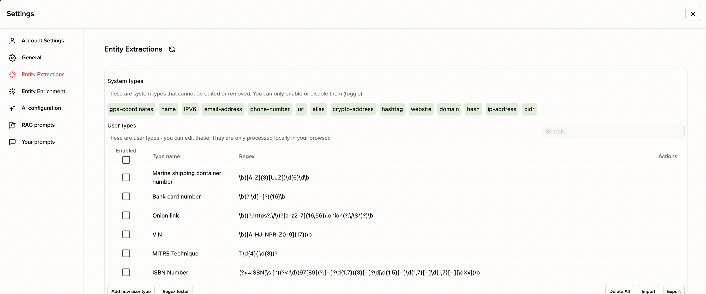
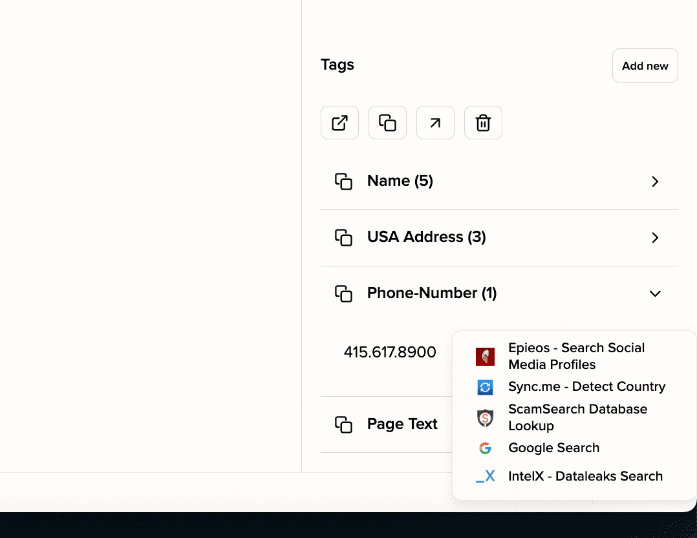
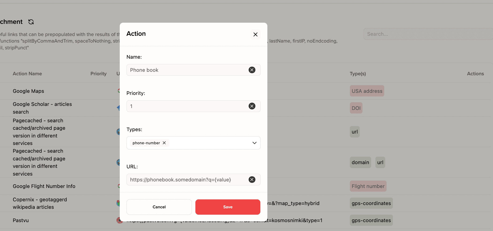
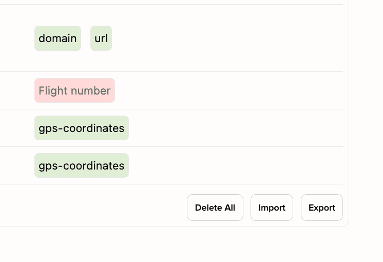

# Ubikron Advanced Enrichments

A list of a couple hundred data enrichments for Ubikron (Next-generation OSINT tool). 

##  Table of contents

- [What is Ubikron?](#what-is-ubikron)
- [What is "data type" and extraction?](#what-is-data-type-and-extraction)
- [What is enrichment?](#what-is-enrichments)
- [How to add enrichment in Ubikron?](#how-to-add-enrichment-in-ubikron)
- [How to add many enrichments at once](#how-to-add-many-enrichments-at-once)
- [Value Function](#vaalue-functions)
- [I developed an online tool. How can i make Ubikron users use it in enrichments](#i-developed-an-online-tool-how-can-i-make-ubikron-users-use-it-in-enrichments)
- [Emoji in enrichments descriptions](#emoji-in-enrichments-descriptions)
- [Enrichments list](#vin)
  - [VIN](#vin)
  - [Aviation](#aviation)
  - [Maritime](#maritime)
  - [Crypto](#crypto)
  - [Bank cards](#bank-card-number)
  - [GEOINT](#geoint)
  - [Person Background](#person-background)
  - [People Search Google Dorks](#people-search-dorks)
  - [Email](#email)
  - [Alias](#alias)
  - [Phone](#phone)
  - [Socmint](#socmint)
  - [Dating](#dating)
  - [Recruting](#recruting)
  - [Government](#government)
  - [Business](#business)
  - [TV/Radio](#tvradio)
  - [Newspapers](#newspapers)
  - [Science](#science)
  - [Archives](#archives)
  - [Search Engines](#search-engines)
  - [Open Directories/Torrents](#open-directoriestorrents)
  - [Video](#video)
  - [Streaming](#streaming)
  - [Books](#books-advanced)
  - [Photos](#photos)
  - [Music](#music)
  - [Website](#website)
  - [Google Vulnerable Files Search](#google-vulnerable-files-search)
  - [URL](#url)
  - [IP](#ip)
  - [Hash](#hash)

## What is Ubikron?

Ubikron is a Chrome Extension that add dozens of new features to your browser to make your intelligence work more efficient. It can automatically save page text and screenshots, extract key data (emails, phone numbers, usernames) and search for them in dozens of #osint tools. Analyse information and write reports using AI prompts. Actually, it has many other features.

[Ubikron.com: How it works](https://www.ubikron.com/how-it-works)
[Ubikron.com: Install](https://www.ubikron.com/install)
[YouTube: Complete Video Tutorial](https://www.youtube.com/watch?v=zwb9V3N5iV0&t=4709s)

## What is "data type" and entity extraction?

After Ubikron saves the text and screenshot of the page into a project, it extracts well known entities (emails, phone numbers, nicknames, ISBN etc) from it using regular expressions. This is called entity extraction.

Default extractions are: GPS coordinates, name, IPV6, email address, phone number, url, alias, crypto address, hashtag, website, domain, hash, ip address and cidr.

To see what extra extractions you have and to set up new ones, go to the menu Settings -> Entity extractions.

## What is entity enrichment?

If you right-click on a string of extracted data (such as a phone number), a contextual menu opens with quick links to collect information about it. For example, search for social media profiles with Epieos and check against the ScamSearch database.

By default, there are only a few universal enrichments for each data type, but you can remove the unnecessary ones and install additional ones that best suit the goals of your investigation.

## How do we add enrichment in Ubikron?

Go to Settings -> Entity Enrichments.

Click "Add new action" button.

Specify the name of the data enrichments (any name you feel comfortable with)

Optionally, set the priority (where the enrichment will be displayed in the context menu).

Select one or more data types for which this enrichments will be active. If a data type is missing from the list, open Entity extraction and add it there (just copy the regular expression from this repository or another source).

Specify the URL for enrichment. This should be a site that can be manipulated to download data using URL parameters (GET requests). Replace the parameter value with {value}. You can see many examples of such sites below in this repository.

Click "Save".

Press F5 to finally add enrichment to the context menu.

## Can we add many enrichments at once?

You can export your enrichments list as a TXT file to import into your other projects or share with other users.

Use the buttons in the bottom right corner to do this.

To import all the enrichments mentioned in this list you can import one file: all_advanced_enrichments.txt (we can't link it here, else GitHub kicks the repo)

## Value functions

Sometimes the format of the extracted data does not match the format used by a particular search tool. A simple example: ISBN (International Standard Book Number) is extracted with dashes, but Amazon Books uses the number without dashes as the URL parameter. This problem is solved by using the stripPunct function:

https://www.amazon.com/s?i=stripbooks&rh=p_66%3A{value:stripPunct}

Also, sometimes it is only necessary to find information on a portion of the extracted data. For example, username from an email address or last name from a full name:

https://www.truthfinder.com/results/?firstName={value:firstName}&lastName={value:lastName}

Just add :functionName to value. Here's a list of functions that can be added now:

| Function name | Description | Input value | Output value |
| --- | --- | --- | --- |
| firstName | Get first name from full name (first word from two) | Porting Notfound | Porting |
| lastName | Get first name from full name (second word from two) | Porting Notfound| Notfound|
| domainFromEmail | Get domain name from email address | kosie123.kramer@kramer.com | kramer.com |
| stripPunct | Remove anything that is not A-Z or a-z or 0-9 | 978-2-13-060852-3 | 9782130608523 |
| spaceToNothing | Delete spaces from string | Porting Notfound | PortingNotfound|
| stripPhone | Replace all no digits symbols to dashes | +1 086 123 1234 | -1-086-123-1234 |
| spaceToDash | Replace all spaces to dashes | +1 086 123 1234  | +1-086-123-1234 |
| spaceToSlash | Replace all spaces to slashes  | +1 086 123 1234 | +1/086/123/1234 |
| firstIP | Remove symbols after / from IP string | 192.1.56.10/96| 192.1.56.10 |
| noEndcoding | By default, all values are handled by the encodeURI() standard JavaScript function. This function cancels encoding. | https%3A%2F%2Fwww.facebook.com%2FCristiano | https://www.facebook.com/Cristiano|
| userFromEmail | Get username from email address  | kosie@kramer.com| kosie |
| splitByCommaAndTrim | Split string by comma and remove spaces | abc , def | abc |

## Advanced extractions

Ubikron has the ability to add an unlimited number of extractions using regular expressions (PCRE). But keep in mind that too many regular expressions can slow down data extraction from web pages. Therefore, we recommend disabling those that don't fit the purpose of your current investigation.

Here is a list of extractions that are not added to Ubikron by default, but are used in enrichments from the list below.

| Extraction name | Description | Regex | Match example |
| --- | --- | --- | --- |
| vin | Venicle Identification Number | \b([A-HJ-NPR-Z0-9]{17})\b | 6ZZ0000PV35400637 |
| bank-card-number | Bank Card Number | \b(?:\d[ -]?){16}\b | 4166 6766 6766 6746 |
| shipping container  | Shipping Container Number | \b([A-Z]{3}[UJZ])\d{6}\d\b | MSCU5285725 |
| flight-number  | Flight Number  | \b([A-Z]{2,3}\d{1,4}[A-Z]?)\b | AA6881 |
| doi | Digital Object Identifier | 10.\d{4,9}/[-._;()/:A-Z0-9]+ | 10.1007/BF00137611  |
| cin | Corporate Identification Number | \b[LUlu][0-9]{5}[A-Za-z]{2}[0-9]{4}[A-Za-z]{3}[0-9]{6}\b | U45203WB1995PTC074213  |

PS: All of the extractions can be imported from this file:  [all_advanced_extractions.txt](https://github.com/ubikron/Advanced-Enrichment/Advanced-Enrichment/all_advanced_extractions.txt).

## I developed an online tool. Can I make Ubikron users use it with enrichments?

If you've made some sort of information gathering tool, it's legal and it can be run via a link with a URL parameter, we'd probably be happy to add it to this one on the list. Write about it in the issues to this repository.

## Emoji in enrichments descriptions

In this list, we tried to focus on tools that provide at least some of the information for free and without registration. We also try to mention tools that do not violate the law. But there are some exceptions, which are marked with appropriate emoji:

🔑 - login required  

💰 - paid subscrition required  

## Enrichments list 

Please, first import [all_advanced_extractions.txt](https://github.com/ubikron/Advanced-Enrichment/Advanced-Enrichment/all_advanced_extractions.txt) before importing enrichments files.

### VIN

| Name | Data types  | Additional notes |  Enrichment |
| --- | --- | --- | --- |
| VINDecoderz - Venicle Info | vin |  | https://www.vindecoderz.com/EN/check-lookup/{value} |
| Searchquarry - Venicle and Car Model Info | vin | | https://www.searchquarry.com/vin-decoder/search/{value}|
| FaxVIN - Venicle Info | vin |  | https://www.faxvin.com/order/decoder?vin={value} |

[Load enrichments](https://github.com/ubikron/Advanced-Enrichment/Advanced-Enrichment/VIN.txt)

### Aviation

| Name | Data types  | Additional notes|  Enrichment |
| --- | --- | --- | --- |
| Google Flight Number Info  | flight-number |  | https://www.google.com/search?q={value} |

[Load enrichments](https://github.com/ubikron/Advanced-Enrichment/Advanced-Enrichment/Aviation.txt)

### Maritime 

| Name | Data types  | Additional notes|  Enrichment |
| --- | --- | --- | --- |
| SeaRates - Container Route and Vessel Info | marine-shipping-container-number |  | https://www.searates.com/container/tracking/?number={value}|

[Load enrichments](https://github.com/ubikron/Advanced-Enrichment/Advanced-Enrichment/Maritime.txt)

### Crypto 

| Name | Data types  | Additional notes |  Enrichment |
| --- | --- | --- | --- |
| 3xpl - Bitcoin Address Status | crypto-address |  | https://3xpl.com/bitcoin/address/{value} |
| Blockchain.com - Wallet Explorer | crypto-address   |  | https://www.blockchain.com/explorer/search?search={value} |
| Blockchair - Bitcoin Walllet Explorer | crypto-address  |  | https://blockchair.com/bitcoin/address/{value}  |
| BlockPath - Transanctions list | crypto-address  |  | https://blockpath.com/search/addr?q={value} |

[Load enrichments](https://github.com/ubikron/Advanced-Enrichment/Advanced-Enrichment/Crypto.txt)

### Bank card number

| Name | Data types  | Additional notes |  Enrichment |
| --- | --- | --- | --- |
| Bincheck - bank/card info | bank-card-number | Check bank and card information | https://bincheck.io/details/{value:spaceToNothing}  |

[Load enrichments](https://github.com/ubikron/Advanced-Enrichment/Advanced-Enrichment/Bank_card_number.txt)

### GEOINT

| Name | Data types  | Additional notes  |  Enrichment |
| --- | --- | --- | --- |
| Open Street Map | usa-address |  | https://www.openstreetmap.org/search?query={value}&zoom=13|
| Google Maps | usa-address |  | https://www.google.com/maps/search/{value} |
| Pastvu - Old Photo Map | gps-coordinates |  | https://pastvu.com?g={value:noEndcoding}&z=17&s=osm&t=kosmosnimki&type=1 |
| Copernix - Geotagged Wikipedia Articles  | gps-coordinates |  | https://copernix.io/#?where={value:noEndcoding},4&?query=&?map_type=hybrid |
| FIRMS -  NASA Fire Map | gps-coordinates |  | https://firms.modaps.eosdis.nasa.gov/map/#d:24hrs;@{value:noEndcoding},4.0z |
| Ventusky - Weather History Map | gps-coordinates |  | https://www.ventusky.com/?p={value:noEndcoding};1800&l=temperature-2m |

[Load enrichments](https://github.com/ubikron/Advanced-Enrichment/Advanced-Enrichment/geoint.txt)

### Person Background 

| Name | Data types  | Additional notes |  Enrichment |
| --- | --- | --- | --- |
| Predicta Search - Social media accounts | name |  | https://www.predictasearch.com/?q={value} |
| Webmii - People Search | name |  | http://webmii.com/people?n={value} |
| Truth Finder - People Search | name |  | https://www.truthfinder.com/results/?firstName={value:firstName}&lastName={value:lastName} |
| Been Verified - USA White Pages Lookup | name |  | https://www.beenverified.com/people/{value:firstName}-{value:LastName} |
| BlockShopper - Recent Properties Sales | name  |   |https://blockshopper.com/search?type=names&q={value:firstName}+{value:LastName}  |
| ClustrMaps - USA Whitepages Lookup| name |   | https://clustrmaps.com/persons/{value:firstName}-{value:LastName}  |
| Locate Family Google CSE | name |  | https://cse.google.com/cse?cx=partner-pub-7233843800519946:6667570044&ie=UTF-8&q={value:firstName}+{value:LastName}  |
| Archive.org - USA Goverment (.gov) PDF Mentions | name |  | https://web.archive.org/collection-search/gov-pdf/{value} |
| Family Search - Genealogy Records  | name  |  | https://www.familysearch.org/en/surname?surname={value:LastName} |
| Geni - Genealogy Records  | name |  | https://www.geni.com/search?search_type=people&names={value:LastName} |
| Geneanet - Genealogy records | name |  | https://en.geneanet.org/fonds/individus/?go=1&nom={value:LastName}&prenom=&prenom_operateur=or&with_variantes_nom=&with_variantes_nom_conjoint=&with_variantes_prenom=&with_variantes_prenom_conjoint=&size=10  |
| PeekYou - Public Records/Background Search | name |  | https://www.peekyou.com/{value:firstName}_{value:lastName}  |
| PeekYou - Public Records/Background Search  | alias |  | https://www.peekyou.com/username={value} |
| Scribd - Documents Search | name |  | https://www.scribd.com/search?query={value:firstName}%20{value:lastName} |
| NameBerry - first name variation | name | When searching for mentions of the person of interest (on the social media page of a related person, in company chats, etc.), it is important to use different variations of their name. For example. John - Johnatan, Johny. In some countries, the first name may have dozens of variants  | https://nameberry.com/search?q={value:firstName} |

[Load enrichments](https://github.com/ubikron/Advanced-Enrichment/Advanced-Enrichment/Person_background.txt)

### People search dorks

| Name | Data types  | Additional notes |  Enrichment |
| --- | --- | --- | --- |
| Google - Telegram Users Search | alias  |  |  https://www.google.com/search?q=inurl%3At.me+{value} | 
| Google - CSV, Excel, Database Search |  domain, alias, name  |  | https://www.google.com/search?q=filetype%253Axls%2BOR%2Bfiletype%253Acsv%2BOR%2Bfiletype%253Axlsx%2BOR%2Bfiletype%253Asql%2Bsite%253A{value} |
| Google - Face Images Search| name, alias | | https://www.google.com/search?q=%22{value:firstName}+{value:lastName}%22&tbs=itp:face&udm=2 | 
| Google - DOCX, PDF, PPTX Mentions| alias, name | Search docx, pptx and pdf mentions  | https://www.google.com/search?q={value}0%9D+filetype%3Apdf+OR+filetype%3Apptx+OR+filetype%3Adocx |
| Google - Profiles Search | alias | Search usernames in URL. Works like Marple (https://github.com/soxoj/marple) osint tool   | https://www.google.com/search?q=inurl%3A{value} |
| Google - Emails Search by Emodji) | name |  | https://www.google.com/search?q={value}D%2BAND%2B%28%F0%9F%93%A7%2BOR%2B%F0%9F%93%A8%2BOR%2B%F0%9F%93%A9%2BOR%2B%E2%9C%89%29 |
| Google - Phones Search by Emodji) | name |  | https://www.google.com/search?q={value}%2BAND%2B%28%25E2%259C%2586%2BOR%2B%25E2%2598%258E%2BOR%2B%25E2%2598%258F%2BOR%2B%25F0%259F%2593%25B1%2BOR%2B%25F0%259F%2593%259E%29%0A |
| Google Documents Mentions | name |  | https://www.google.com/search?q=site%3Adocs.google.com%20inurl%3A%22%2Fd%2F%22%20%22{value}%22 |

[Load enrichments](https://github.com/ubikron/Advanced-Enrichment/Advanced-Enrichment/People_search_dorks.txt)

### Email 

| Name | Data types  | Additional notes |  Enrichment |
| --- | --- | --- | --- |
| True People Search | email-address |  | https://www.truepeoplesearch.com/resultemail?email={value}|
| ThatsThem  | email-address  |  | https://thatsthem.com/email/{value} |
| WHOISFreaks - WHOIS History Search | email-address  | WHOIS History email search  | https://whoisfreaks.com/tools/whois/reverse/search/email/{value}?includes=all  |
| MailMeteor - Email Validation | email-address  | Email address validation  | https://mailmeteor.com/email-checker?email={value}|
| Serif.ai - Email Variations Generator | email-address  | When searching for email information in data leaks and other sources, keep in mind that people often use email variants with extra dots to register multiple accounts to a single address. Look for different variants. | https://www.serif.ai/tools/gmail-generator?email={value} |

[Load enrichments](https://github.com/ubikron/Advanced-Enrichment/Advanced-Enrichment/Email.txt)

### Alias 

| Name | Data types  | Additional notes|  Enrichment |
| --- | --- | --- | --- |
| Instant Username | alias |  | https://instantusername.com/?q={value} |
| NameCheck - Domain Names Search | alias  |  | https://namechk.com/namechk-plugin-search-results/?n={value}|
| NameVine - Domain Names Search | alias  |  | https://namevine.com/#/{value} |
| Telegago Telegram CSE | alias  |  | https://cse.google.com/cse?q=+&cx=006368593537057042503:efxu7xprihg#gsc.tab=0&gsc.q=%20{value}&gsc.sort=date%22 |

[Load enrichments](https://github.com/ubikron/Advanced-Enrichment/Advanced-Enrichment/Alias.txt)

### Phone 

| Name | Data types  | Additional notes|  Enrichment |
| --- | --- | --- | --- |
| TruePeopleSearch | phone  |  | https://www.truepeoplesearch.com/results?phoneno={value} |
| USA White Pages Mentions | phone |  | https://www.whitepages.com/phone/{value} |
| 🔑  TrueCaller - People Search | phone |  | https://www.truecaller.com/search/us/{value} |
| CyberBackgroundChecks - People Search | phone |  | https://www.cyberbackgroundchecks.com/phone/{value} |

[Load enrichments](https://github.com/ubikron/Advanced-Enrichment/Advanced-Enrichment/Phone.txt)

### SOCMINT 

| Name | Data types  | Additional notes |  Enrichment |
| --- | --- | --- | --- |
| Github - users search | alias |  | https://github.com/search?q={value}&type=users |
| X - last tweets from user | alias |  | https://x.com/search?q=from%3A{value}&src=typed_query&f=live |
| Instagram Profile | alias |  | https://www.instagram.com/{value} |
| Facebook Profile | alias  |  | https://www.facebook.com/{value} |
| X - Hashtag Search  | hashtag |  | https://x.com/hashtag/{value} |
| Tumblr Profile | alias |  | https://{value}.tumblr.com/ |
| Instagram - Hashtag Search  | hashtag |  | https://www.instagram.com/explore/tags/{value} |
| Facebook - People Search | name |  | https://www.facebook.com/search/people/?q={value}&epa=SERP_TAB |
| Social Searcher - Social Media Mentions Search | name, alias |  | https://www.social-searcher.com/social-buzz/?q5={value} |
| Disboard - Discord Servers Search | alias, name | Discord servers search engine | https://disboard.org/search?keyword={value} |
| Pinterest Mentions | hashtag |  | https://www.pinterest.com/search/pins/?q=%23{value}|
| Medium Mentions | hashtag,alias,name |  | https://medium.com/search?q=%23{value} |
| Reddit Mentions | hashtag,alias,name |  | https://www.reddit.com/search/?q=%23{value} |

[Load enrichments](https://github.com/ubikron/Advanced-Enrichment/Advanced-Enrichment/Socmint.txt)

### Dating

| Name | Data types  | Additional notes|  Enrichment |
| --- | --- | --- | --- |
| Badoo Wayback Collection - Mentions Search | name | | https://web.archive.org/collection-search/{value:firstName}/ |
| Tinder Profile | alias |  | https://www.tinder.com/@{value}  |

[Load enrichments](https://github.com/ubikron/Advanced-Enrichment/Advanced-Enrichment/Dating.txt)

### Recruting

| Name | Data types  | Additional notes  |  Enrichment |
| --- | --- | --- | --- |
| Google CV Search | name |  | https://www.google.com/search?q=%22{value:firstName}+{value:lastName}%22+AND+%28%22Resume%22+OR+%22Curriculum+Vitae%22+OR+%22CV%22%29  |
| Indeed CV Search | name | | https://resumes.indeed.com/search?q={value:firstName}+{value:lastName} |
| Linkedin People Search  | name  |  | https://www.linkedin.com/search/results/all/?keywords={value:firstName}%20{value:lastName} |

[Load enrichments](https://github.com/ubikron/Advanced-Enrichment/Advanced-Enrichment/Recruting.txt)

### Government 

| Name | Data types  | Additional notes |  Enrichment |
| --- | --- | --- | --- |
| PACER - USA Court Records Search  | name |  | https://search.uscourts.gov/search?affiliate=uscourts_pacer&locale=en&query={value} |
| Court Listener - USA Court Records Search  | name  | | https://www.courtlistener.com/?type=r&q={value}  |
| FOIA.gov - Freedom of Information Act Documents Search | name |  | https://search.foia.gov/search?affiliate=foia.gov&query={value} |
| MuckRock - USA Goverment Projects and Reporting Search| name |  | https://www.muckrock.com/foi/list/?q=apple |
| Trellis - USA goverment Court Rullings Search  | name  | | https://trellis.law/rulings/%22{value}%22 |
| Voter Records - USA Voter Registration Records | name |  | https://voterrecords.com/voters/{value:firstName}-{value:lastName} |
| Federal Trade Comission Cases Search   | name  | |  https://www.ftc.gov/legal-library/browse/cases-proceedings?search={value}&sort_by=search_api_relevance |
| European Companies Search Engine | name  | | https://www.northdata.com/{value}  |
| USA Arrests Records  | name |  Change California to state that you interested | https://california.arrests.org/search.php?fname={value:firstName}&lname={value:lastName}&fpartial=True |

[Load enrichments](https://github.com/ubikron/Advanced-Enrichment/Advanced-Enrichment/Government.txt)

### Business 

| Name | Data types  | Additional notes |  Enrichment |
| --- | --- | --- | --- |
| AIHIT - Worldwide Companies Database Search  | name |  | https://www.aihitdata.com/search/companies?t={value} |
| Open Payrolls - USA Salary Records Search | name  |  | https://openpayrolls.com/search/{value:firstName}-{value:lastName} |
| Open Supply Hub - Facilities Search  | name | | https://opensupplyhub.org/facilities?q={value} |
| B2BHINT - Worldwide Business Entities Database| name |  | https://b2bhint.com/en/search?q={value}&sort=default&type=companies |
| Quick Company - Business Entities Info  | cin |  | https://www.quickcompany.in/company/search?q={value}|
| LEI Records Search | name |  | https://search.gleif.org/#/search/simpleSearch={value:firstName}%20{value:lastName}|
| Industry Documents Search | name | Digital archive of documents created by industries which influence public health (tobacco, chemical, drug, fossil fuel) | http://industrydocuments.ucsf.edu/results/#q={value:firstName}%20{value:lastName}|
| LEI Info Search | name |  | https://lei.info/fullsearch?for={value:firstName}%20{value:lastName}  |
| NonProfitExplorer Search | name  |  | https://projects.propublica.org/nonprofits/search?q={value:firstName}+{value:lastName} |
| ImportYeti Search | name  | 70 millions U. S. customs sea shipments records | https://www.importyeti.com/search?q={value:firstName}%20{value:lastName&page=1 |

[Load enrichments](https://github.com/ubikron/Advanced-Enrichment/Advanced-Enrichment/Business.txt)

### TV/radio

| Name | Data types  | Additional notes |  Enrichment |
| --- | --- | --- | --- |
| Archive.org TV news - Search TV Captions since 2009 | name  | | https://archive.org/details/tv?q={value} |
| American Archive of Public Broadcasting Search | name | | https://americanarchive.org/catalog?q={value} |
| Television Vanderbilt News Archive - News since 1968  | name | Be patient, loading results may be slow | https://tvnews.vanderbilt.edu/search?query={value} |
| BBC Archive Search | name |  | https://www.bbc.co.uk/search?q={value} |

[Load enrichments](https://github.com/ubikron/Advanced-Enrichment/Advanced-Enrichment/Tv_radio.txt)

### Newspapers

| Name | Data types  | Additional notes |  Enrichment |
| --- | --- | --- | --- |
| Library of congress - archive Search | name, alias, domain  |  | https://www.loc.gov/search/?new=true&q={value} |
| Google Newspapers Search  | name, alias, domain  |  | https://www.google.com/search?q={value}&tbm=bks&tbs=bkt:s&source=newspapers |
| Newspapers.com - Archive Search | name, alias, domain  | 🔑 Archive search | https://www.newspapers.com/results/?keyword={value}&locale=en-US |
| Newspaper Archive - search since 1700  | name |  | https://newspaperarchive.com/tags/?pf={value:firstName}&pl={value:lastName}/  |
| United Kingdom national Archive Search | name | | https://www.nationalarchives.gov.uk/search/results?_q={value} |
| The British Newspaper Archive Search | name |  | https://www.britishnewspaperarchive.co.uk/search/results?basicsearch={value} |

[Load enrichments](https://github.com/ubikron/Advanced-Enrichment/Advanced-Enrichment/Newspapers.txt)

### Science

| Name | Data types  | Additional notes |  Enrichment |
| --- | --- | --- | --- |
| BaseSearch | name,doi |  | https://www.base-search.net/Search/Results?lookfor={value} |
| Google Scholar Search | name,doi | | https://scholar.google.com/scholar?q={value} |
| CrossRef Search | doi |  | https://search.crossref.org/search/works?q={value}&from_ui=yes |
| ResearchGate | doi |  | https://www.researchgate.net/search/publication?q={value} |

[Load enrichments](https://github.com/ubikron/Advanced-Enrichment/Advanced-Enrichment/Science.txt)

### Archives

| Name | Data types  | Additional notes |  Enrichment |
| --- | --- | --- | --- |
| Wayback Machine Main Page Snapshots | domain,url |  | https://web.archive.org/web/20250000000000*/{value}  |
| Pagecached - Cached/Archived Pages in Different Services | url,domain |  | https://pagecached.com/?url={value} |
| Webcitation Archive Snapshots | domain, url  |  | https://www.webcitation.org/query?url={value} |
| Archive.is Snapshots | domain, url   |  | http://archive.is/newest/{value} |
| Arquivo.pt Snapshots | domain, url  |  | http://archive.wikiwix.com/cache/index2.php?url={value} |
| Archive-it.org Mentions | domain, url  |  | https://archive-it.org/explore?q={value} |
| Troove Snapshots | domain, url   |  | https://trove.nla.gov.au/search/category/websites?keyword={value} |
| Stanford Web Archive Snapshot  | domain, url  |  | https://swap.stanford.edu/was/*/{value} |
| Ghost Archive  | domain |  | https://ghostarchive.org/search?term={value} |

[Load enrichments](https://github.com/ubikron/Advanced-Enrichment/Advanced-Enrichment/Archives.txt)

### Search engines

| Name | Data types  | Additional notes |  Enrichment |
| --- | --- | --- | --- |
| Google Search | alias, name, domain, crypto-address  |  | https://www.google.com/search?q={value} |
| Yandex Search  | alias, name, domain, crypto-address |  | https://yandex.ru/search/?text={value}  |
| Bing Search | alias, name, domain, crypto-address  |  | https://www.bing.com/search?q={value} |
| Wikipedia Search | alias, name, domain |  | https://wikipedia.org/w/index.php?search={value} |
| Marginalia Search | alias, name, domain  | Search blogs, plain text files, wikis, forums and other "no standard" sources | https://marginalia-search.com/search?query={value} |
| Wolfram Alpha | alias, name, domain, ip-address |  | https://www.wolframalpha.com/input?i={value}  |

[Load enrichments](https://github.com/ubikron/Advanced-Enrichment/Advanced-Enrichment/Search_engines.txt)

### Open directories/torrents

| Name | Data types  | Additional notes|  Enrichment |
| --- | --- | --- | --- |
| FilePursuit - Open Directories Search | alias,name | Open directories search engine  |  https://filepursuit.com/pursuit?q={value}&type=all |
| ODCrawler - Open Directories Search  | alias,name | Open directories search engine | https://odcrawler.xyz/search/{value} |
| EyeDex - Open Directories Search  | alias,name   | Open directories search engine  | https://www.eyedex.org/search/?q={value}|
| BTDIG - Torrents Search| alias,name | BitTorrent search engine | https://btdig.com/search?order=0&q={value} |

[Load enrichments](https://github.com/ubikron/Advanced-Enrichment/Advanced-Enrichment/Open_directories_torrents.txt)

### Video

| Name | Data types  | Additional notes |  Enrichment |
| --- | --- | --- | --- |
| Filmot - YouTube 1.3B+ subtitles search| alias, name | | https://filmot.com/search/{value}/1?gridView=1 |
| YouTube Search | name,alias,domain, hashtag   |  | https://www.youtube.com/results?search_query={value} |
| Vimeo Search  | name,alias,domain, hashtag  |  | https://vimeo.com/search?q={value}|
| DailyMotion Search  | name,alias,domain, hashtag  |  | https://www.dailymotion.com/search/{value}/top-results |
| Rumble Search | name,alias,domain,hashtag |  | https://rumble.com/search/all?q={value} |
| Playeur Search  | name,alias,domain,hashtag  |  | https://playeur.com/search?q={value} |
| TikTok Search| name,alias,domain, hashtag |  | https://www.tiktok.com/search/user?lang=en&q={value}  |

[Load enrichments](https://github.com/ubikron/Advanced-Enrichment/Advanced-Enrichment/Videos.txt)

### Streaming

| Name | Data types  | Additional notes|  Enrichment |
| --- | --- | --- | --- |
| Twitch Search | name,alias,domain, hashtag |  | https://www.twitch.tv/search?term={value} |
| Kick Search | name,alias,domain, hashtag |  | https://kick.com/search?query={value}  |
| Trovo Search| name,alias,domain, hashtag |  | https://trovo.live/search?q={value} |

[Load enrichments](https://github.com/ubikron/Advanced-Enrichment/Advanced-Enrichment/Streaming.txt)

### Books

| Name | Data types  | Additional notes |  Enrichment |
| --- | --- | --- | --- |
| ViaLibri - Search for ADS for Old Books for Sale | isbn-number | | https://www.vialibri.net/searches?all_text={value}|
| Open Liblary - Books Search | name, alias | archive.org books search | https://openlibrary.org/search?q={value}&mode=everything |

[Load enrichments](https://github.com/ubikron/Advanced-Enrichment/Advanced-Enrichment/Books.txt)

### Photos

| Name | Data types  | Additional notes |  Enrichment |
| --- | --- | --- | --- |
| Flickr Search | name, alias, hashtag |  | https://www.flickr.com/search/?text={value} |
| DepositPhotos Search | name, alias, hashtag  |  | https://depositphotos.com/photos/{value}.html?filter=all |
| ShutterStock Search | name, alias, hashtag  |  | https://www.shutterstock.com/search/{value} |

[Load enrichments](https://github.com/ubikron/Advanced-Enrichment/Advanced-Enrichment/Photos.txt)

### Music

| Name | Data types  | Additional notes |  Enrichment |
| --- | --- | --- | --- |
| SoundCloud Search | name, alias, hashtag  |  | https://soundcloud.com/search?q={value} |
| Spotify Search | name, alias, hashtag  |  | https://open.spotify.com/search/{value} |
| Deezer Search | name, alias, hashtag  |  | https://www.deezer.com/search/{value}  |

[Load enrichments](https://github.com/ubikron/Advanced-Enrichment/Advanced-Enrichment/Music.txt)

### Website 

| Name | Data types  | Additional notes |  Enrichment |
| --- | --- | --- | --- |
| Seositechekup - Traffic Analyze | domain |  | https://seositecheckup.com/seo-audit/{value} |
| ZoomEye - Domain Lookup | domain |  | https://www.zoomeye.org/searchResult?q={value} |
| WHOIS - Domain Lookup | domain |  | https://www.whois.com/whois/{value} |
| ReverseWhois.op - Domain Lookup | domain |  | https://www.reversewhois.io/?searchterm={value} |
| GreyNoise - Domain Lookup  | domain |  | https://www.greynoise.io/viz/ip/{value} |
| Domaintools - Whois Lookup | domain  |  | https://whois.domaintools.com/{value} |
| ViewDNS - Reverse WHOIS Search | domain  |  | https://viewdns.info/reversewhois/?q={value} |
| DNSLytics - Domain Lookup | domain |  | https://dnslytics.com/ip/{value} |
| Domain Digger - Domain Lookup | domain  |  | https://digger.tools/lookup/nytimes.com{value}  |
| URL Hause - Check malicious URLs Database | domain,url | Check malicious URLs database  | https://urlhaus.abuse.ch/browse.php?search={value} |
| Email Format Discovery Google CSE  | domain |  | https://cse.google.com/cse?cx=f7b8419d790c84f19&q=%22{value}%22 |
| BigDomainData - Domain Lookup  | domain |  | https://www.bigdomaindata.com/whois/{value}  |

[Load enrichments](https://github.com/ubikron/Advanced-Enrichment/Advanced-Enrichment/Website.txt)

### Google vulnerable files search

| Name | Data types  | Additional notes|  Enrichment |
| --- | --- | --- | --- |
| Google - Excel, CSV and SQL databases | domain |  | https://www.google.com/search?q=filetype%3Axls%2BOR%2Bfiletype%3Acsv%2BOR%2Bfiletype%3Axlsx%2BOR%2Bfiletype%3Asql%2Bsite%3A{value} |
| Google - Documents Mentions | domain |  | https://www.google.com/search?q=site%3Adocs.google.com%20inurl%3A%22%2Fd%2F%22%20%22{value}%22 |
| Google - PDFs and MS Office documents | domain |  | https://www.google.com/search?q=site%253A{value}D%2Bext%253Atxt%2B%257C%2Bext%253Apdf%2B%257C%2Bext%253Axml%2B%257C%2Bext%253Axls%2B%257C%2Bext%253Axlsx%2B%257C%2Bext%253Appt%2B%257C%2Bext%253Apptx%2B%257C%2Bext%253Adoc%2B%257C%2Bext%253Adocx |
| Google - Juicy Info Files | domain |  | https://www.google.com/search?q=site%3A{value}%20ext%3Alog%20%7C%20ext%3Atxt%20%7C%20ext%3Aconf%20%7C%20ext%3Acnf%20%7C%20ext%3Aini%20%7C%20ext%3Aenv%20%7C%20ext%3Ash%20%7C%20ext%3Abak%20%7C%20ext%3Abackup%20%7C%20ext%3Aswp%20%7C%20ext%3Aold%20%7C%20ext%3A~%20%7C%20ext%3Agit%20%7C%20ext%3Asvn%20%7C%20ext%3Ahtpasswd%20%7C%20ext%3Ahtaccess%20%7C%20ext%3A |
| Google - Backup Files | domain |  | https://www.google.com/search?q=site:{value}%2Bext%3Abkf%2B%7C%2Bext%3Abkp%2B%7C%2Bext%3Abak%2B%7C%2Bext%3Aold%2B%7C%2Bext%3Abackup |
| Google - Open Directories Search without Subdomains | domain |  | https://www.google.com/search?q=intitle%253A%2522index%2Bof%2522%2Bsite%253A{value}  |
| Google -Open Directories with Subdomains | domain |  | https://www.google.com/search?q=intitle%253A%2522index%2Bof%2522%2Bsite%253A*,{value} |
| Google - .git folder| domain  |  | https://www.google.com/search?q=inurl:%22{value}%20%22nytimes.com%20-github |
| Google - Logs files | domain |  | https://www.google.com/search?q=site:{value}%20ext:log |
| Google - Phpinfo files| domain |  | https://www.google.com/search?q=site:{value}%20ext:php%20intitle:phpinfo%20%27published%20by%20the%20PHP%20Group%27 |
| Google - Open Redirect | domain  |  | https://www.google.com/search?q=site:{value}%20inurl:redir%20|%20inurl:url%20|%20inurl:redirect%20|%20inurl:return%20|%20inurl:src=http%20|%20inurl:r=http |
| Google - Config Files | domain |  | https://www.google.com/search?q=site:{value}%20ext:xml%20|%20ext:conf%20|%20ext:cnf%20|%20ext:reg%20|%20ext:inf%20|%20ext:rdp%20|%20ext:cfg%20|%20ext:txt%20|%20ext:ora%20|%20ext:ini  |
| Google - Install/Setup files  | domain |  | https://www.google.com/search?q=site:{value}%20inurl:readme%20|%20inurl:license%20|%20inurl:install%20|%20inurl:setup%20|%20inurl:config  |

[Load enrichments](https://github.com/ubikron/Advanced-Enrichment/Advanced-Enrichment/Google_vulnerable_files_search.txt)

### URL 

| Name | Data types  | Additional notes |  Enrichment |
| --- | --- | --- | --- |
| UNFURL - URL Paramaters Analysis| url | | https:// dfir.blog /unfurl/?url={value} |
| Carbon Dating - Webpage Creation Date  | url |  | https://carbondate.cs.odu.edu/#{value} |

[Load enrichments](https://github.com/ubikron/Advanced-Enrichment/Advanced-Enrichment/Url.txt)

### IP 

| Name | Data types  | Additional notes |  Enrichment |
| --- | --- | --- | --- |
| ZoomEye - IP Lookup | ip-address, IPV6 |  | https://www.zoomeye.org/searchResult?q={value:firstIP} |
| WHOIS - IP Lookup | ip-address, IPV6 |  | https://www.whois.com/whois/{value:firstIP} |
| IKnowWhatYouDownload - Torrent Downloads/Distributions | ip-address, IPV6  |  | https://iknowwhatyoudownload.com/en/peer/?ip={value}  |
| GreyNoise - IP Lookup  | ip-address, IPV6  |  | https://www.greynoise.io/viz/ip/{value:firstIP} |
| Censys - IP Lookup | ip-address, IPV6  |  | https://search.censys.io/hosts/{value}/ |
| ViewDNS - Reverse IP Lookup |ip-address, IPV6    |  | https://viewdns.info/reverseip/?host={value}&t=1 |
| DNSLytics - IP Lookup | ip-address, IPV6   |  | https://dnslytics.com/ip/{value:firstIP} |
| Domain Tools - IP Lookup | ip-address, IPV6   |  | https://whois.domaintools.com/{value:firstIP} |
| ODIN - IP Lookup | ip-address, IPV6   |  | https://search.odin.io/hosts?query={value} |
| Hunter How IP Lookup | ip-address, IPV6  |  | https://hunter.how/list?searchValue=ip%3D%3D%22{value}%22|
| MXToolBox - Blacklist Check |ip-address, IPV6    |  | https://mxtoolbox.com/SuperTool.aspx?action=blacklist%3a{value}&run=toolpage# |

[Load enrichments](https://github.com/ubikron/Advanced-Enrichment/Advanced-Enrichment/Ip.txt)

### Hash 

| Name | Data types  | Additional notes |  Enrichment |
| --- | --- | --- | --- |
| Decrypt Tools - MD5 Decryption | hash |  | https://decrypt.tools/client-server/decrypt?type=md5&{value} |
| Decrypt Tools - Sha1 Decryption | hash |  | https://decrypt.tools/client-server/decrypt?type=sha1&string={value}|

[Load enrichments](https://github.com/ubikron/Advanced-Enrichment/Advanced-Enrichment/Hash.txt)

------------------------------------------------

We plan to add more advanced enrichments in the near future.

Don't miss our updates! [Linkedin](https://www.linkedin.com/company/ubikron/posts/?feedView=all) [YouTube](https://www.youtube.com/watch?v=inLkAmcAgjw)

---------

## Appendix. Default enrichments list

Enrichments that can be found in Ubikron by default, right after installation.

Click "Reset to deafault" to undo all changes you have made to enrichments (including deleting added ones).

| Name | Data types  | Additional notes |  Enrichment |
| --- | --- | --- | --- |
| Epieos - Search Social Media Profiles | email-address |  | https://epieos.com/?q={value}&ua=vortimo |
| Unavatar - Avatar from Gravatar and Other Sources | email-address |  | https://unavatar.io/{value}|
| IntelX - Dataleaks Search | domain |  | https://intelx.io/?s={value}|
| Virus Total - Similar Files | hash |  |https://www.virustotal.com/gui/file/{value} |
| UrlScan.io Database Lookup | url |  | https://urlscan.io/search/#{value}|
| MetaNarka - Metadata Analyzing | url |  | https://meta.narka.io/analyze?url={value}|
| Wayback Machine Snapshots | url |  | https://web.archive.org/web/*/{value:noEncoding}|
| Sync.me - Detect Country | phone-number  |  |https://sync.me/search/?number={value} |
| IntelX - Dataleaks Search | phone-number |  | https://intelx.io/?s={value} |
| ScamSearch Database Lookup | phone-number |  | https://scamsearch.io/search_report?searchoption=all&search={value} |
| Google Search | phone-number |  | https://www.google.com/search?q={value} |
| Epieos - Search Social Media Profiles | phone-number |  | https://epieos.com/?q={value}&ua=vortimo |
| Truth Finder - USA🇺🇲 Address Book | name |  | https://www.truthfinder.com/results/?firstName={value:firstName}&lastName={value:lastName} |
| Facebook - People Search | name |  | https://www.facebook.com/search/people/?q={value}&epa=SERP_TAB |
| Vortimo - Social Media Profiles Search | name |  | https://cse.google.com/cse?cx=009983555355237802955:_kirhgouogi&q={value} |
| Open Corporates - Officers Search | name |  | https://opencorporates.com/officers?q={value} |
| Google - Face Images | name |  | https://www.google.com/search?q={value:firstName}+{value:lastName}&tbs=itp:face&udm=2 |
| USA🇺🇲 White Pages | name |  | https://www.whitepages.com/name/{value} |
| FamilySearch - Genealogy Records | name |  | https://www.familysearch.org/en/surname?surname={value:LastName} |
| Brandmentions - Statistics and analysis | hashtag |  | https://app.brandmentions.com/h/k/%23{value} |
| CheckMyHashtag Analysis | hashtag |  | https://checkmyhashtag.com/results/{value} |
| Facebook Posts | hashtag |  | https://www.facebook.com/hashtag/{value}/ |
| Social Searcher - social media mentions | hashtag |  | https://www.social-searcher.com/social-buzz/?q5=%23{value} |
| X Posts | hashtag |  | https://x.com/hashtag/{value} |
| Instagram Posts | hashtag |  | https://www.instagram.com/explore/tags/{value} |
| Social Searcher - Social Media Mentions | hashtag |  | https://www.social-searcher.com/google-social-search/?q=%23{value} |
| MITRE.org - Documentation | MITRE Technique  |  | https://attack.mitre.org/techniques/{value}/ |
| ISBNsearch - Title, Author, Publisher | ISBN Number |  | https://isbnsearch.org/isbn/{value} |
| Shodan - Servers/Devices Search | IPV6,ip-address  |  | https://www.shodan.io/search?query={value} |
| Google Search | IPV6,ip-address  |  | https://www.google.com/search?q={value} |
| Censys Servers/Devices Search | IPV6,ip-address  |  | https://search.censys.io/hosts/{value:firstIP}/ |
| IPINFO - Geolocation, ASN | IPV6,ip-address  |  | https://ipinfo.io/{value} |
| VirusTotal - Reputation, Registration, WHOIS | IPV6,ip-address |  | https://www.virustotal.com/gui/ip-address/{value:firstIP}/detailss |
| ReverseWHOIS.io | domain |  | https://www.reversewhois.io/?searchterm={value} |
| Virus Total - Domain Info | domain |  | https://www.virustotal.com/gui/domain/{value:domainFromEmail} |
| Verify | email-address  |  | https://hunter.io/verify/{value} |
| Google "site:" Search | domain |  | https://www.google.com/?q=site:{value} |
| BuiltWith - Technology Profile | domain |  | https://builtwith.com/relationships/{value} |
| Talos Intelligence - Reputation Check | domain |  | https://www.talosintelligence.com/reputation_center/lookup?search={value} |
| Ahrefs - Estimated Traffic | domain |  | https://ahrefs.com/traffic-checker/?input={value}&mode=subdomains |
| Virus Total - Subdomains, WHOIS/SSL history | domain |  | https://www.virustotal.com/gui/domain/{value}/relations |
| Domain owners detailed history | domain |  | https://www.whoxy.com/{value}#history |
| Wayback Machine Available URLs | domain |  | https://web.archive.org/web/*/{value}* |
| Visualize and Calculate Network Ranges | cidr |  | https://cidr.xyz/#{value:noEndcoding} |
| InstantDomainSearch - Registred Domains | alias |  | https://instantdomainsearch.com/?q={value} |
| Telegram Mentions | alias |  | https://web.archive.org/collection-search/telegram/{value} |
| Pastebin Mentions | alias |  | https://web.archive.org/collection-search/pastebin.com/{value}  |
| Epieos - Social Media Profiles | alias |  | https://epieos.com/?q={value}&ua=vortimo |
| Leaked Documents Search | alias |  | https://intelx.io/?s={value} |
| Social Searcher - Social Media Mentions | alias |  | https://www.social-searcher.com/social-buzz/?q5={value} |
| Search Profiles in 600+ Social Media | alias |  | https://whatsmyname.app/?q={value} |
| Unavatar - Pic from Gravatar and Other Sources | alias |  | https://unavatar.io/{value} |
| Yandex Satellite Maps | gps-coordinates |  | https://yandex.com/maps/?text={value}&l=sat |
| Google Maps | gps-coordinates |  | https://www.google.com/maps?q={value} |
| Money Flow Visual Statistics | crypto-address |  | https://explorer.crystalblockchain.com/visualization/new/{value} |
| Private Keys Database | crypto-address |  | https://privatekeys.pw/address/bitcoin/{value} |
| Chainabuse - Scam Reports | crypto-address |  | https://chainabuse.com/address/{value} |
| Search Wallet Labels | crypto-address |  | https://www.oklink.com/multi-search#key={value} |
| Blockchain.com - Transactions List | crypto-address |  | https://www.blockchain.com/btc/address/{value} |
| CyberTrace - Wallet Safety Scan | crypto-address  |  | https://tools.cybertrace.com.au/walletscan/{value} |
| 🔑 🆓 💰 Dehashed - Search Password by Hash | hash |  | https://app.dehashed.com/search?q={value} |
| Ghunt - Gmail Account By Login Info | email-address  |  | https://gmail-osint.activetk.jp/{value:userFromEmail} |
| Amazon - search books | ISBN Number |  | https://www.amazon.com/s?i=stripbooks&rh=p_66%3A{value:stripPunct}&s=relevancerank&Adv-Srch-Books-Submit.x=22&Adv-Srch-Books-Submit.y=12&unfiltered=1&ref=sr_adv_b |

-----

Don't miss our updates! [Linkedin](https://www.linkedin.com/company/ubikron/) [YouTube](https://www.youtube.com/@ubikron)
